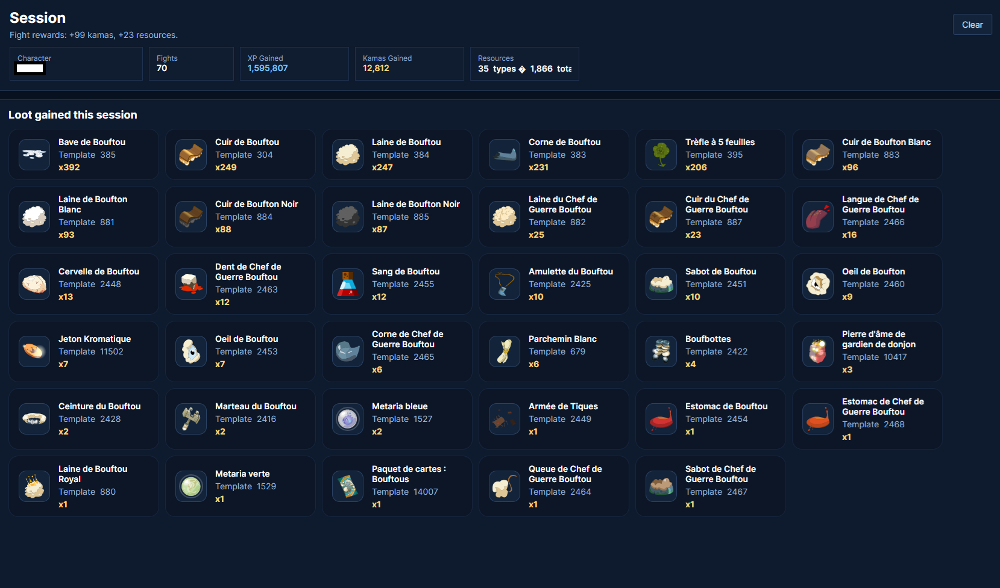
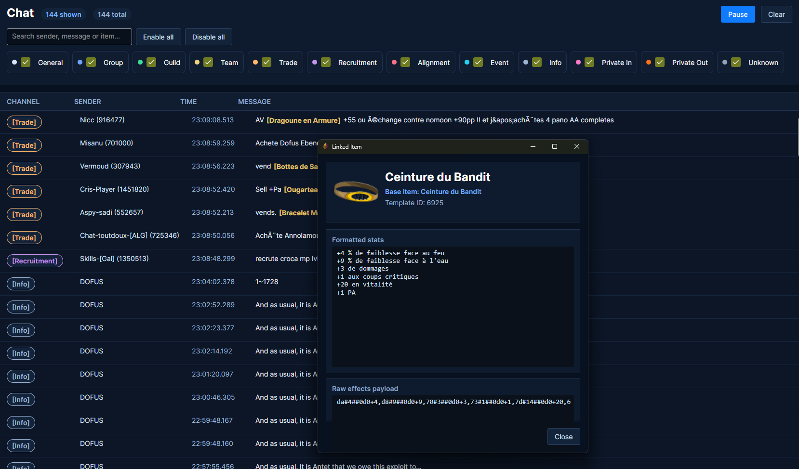
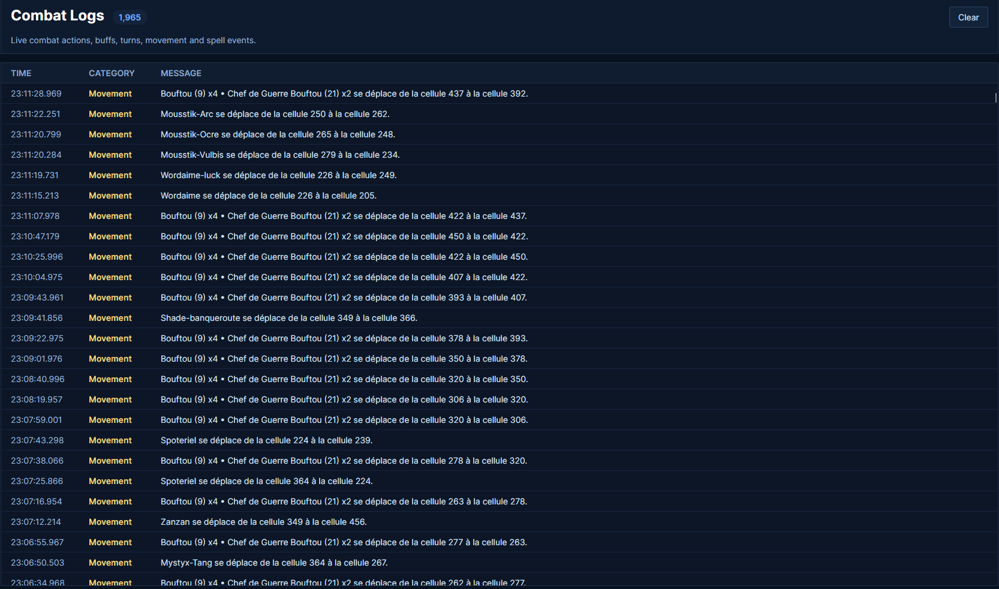
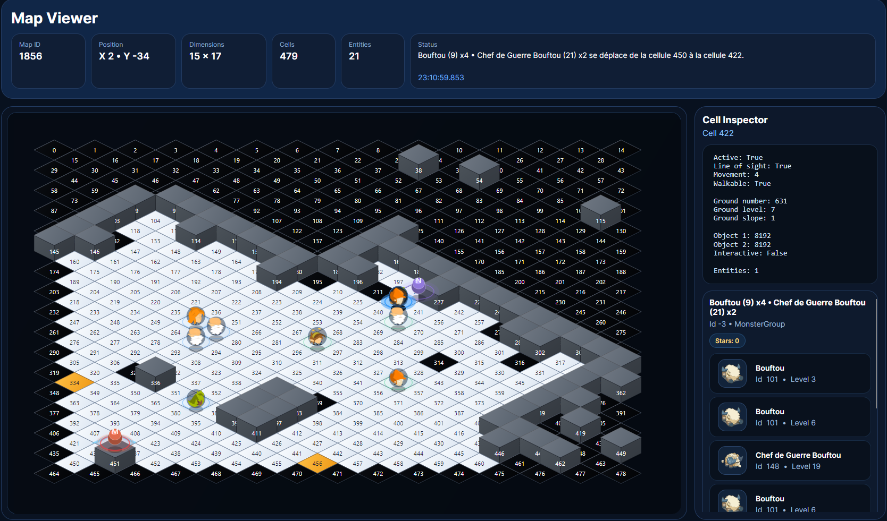
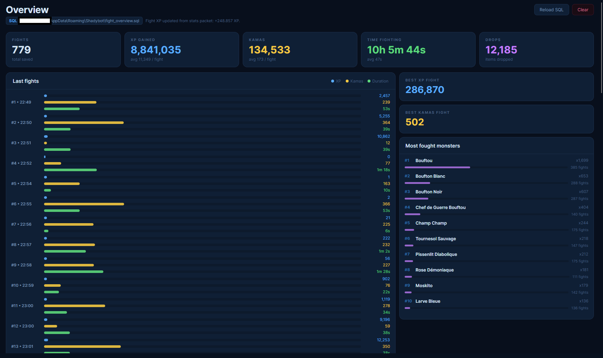
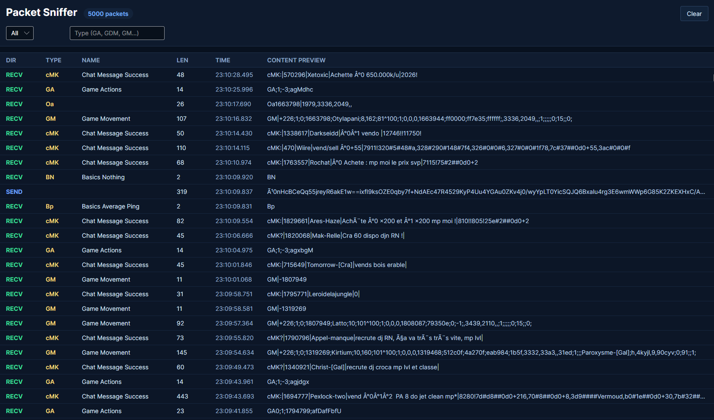

# ShadyBot

# 🚀 Serveur Discord officiel  

# 👉 https://discord.gg/aDh7Pb83Bx

---

## Présentation 

**ShadyBot** est un outil gratuit qui permet d’analyser les paquets du jeu et de les afficher de manière claire et lisible.

Une version **Premium** est également disponible pour accéder à des fonctionnalités d’automatisation avancées et soutenir le développement du bot.

---

## Screenshots

### Session

### Chat

### Logs

### Map

### Overview

### Packet

---

## Fonctionnalités gratuites

- Analyse des paquets
- Mise en forme claire des informations
- Interface avec session, chat, logs, carte et paquets

---

## Fonctionnalités Premium

### Auto Fighter Starter
Lance automatiquement les combats contre les monstres, avec possibilité d’ajouter des exclusions ou des monstres obligatoires.

### Auto Fight
Gère automatiquement les combats avec les sorts et comportements configurés dans l’IA.

### Built-in Custom AI
Scripts personnalisés créés pour le bot.

Donjons actuellement disponibles :

- Donjon Bouftou
- Donjon Forgeron
- Donjon Champs

Une IA plus avancée permet aussi de personnaliser le comportement salle par salle, avec possibilité de capturer les boss.  
Tout est entièrement personnalisable.

---

## Prix Premium

L’accès Premium coûte **9 €/mois**, payable en cryptomonnaie.

Pour acheter Premium, rejoignez le Discord :

# 👉 https://discord.gg/aDh7Pb83Bx

Puis utilisez la commande `!buy` dans le salon d’achat.

---

## Support

Pour toute question, suggestion ou problème de paiement, merci de passer par le serveur Discord.
